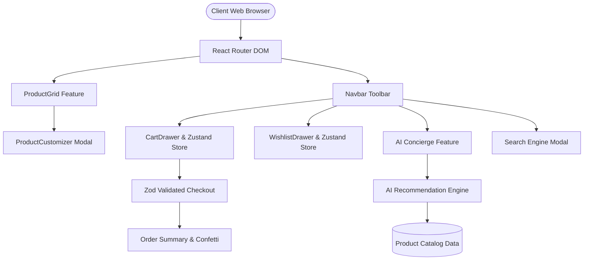

# 💎 Mangata & Gallo — AI-Powered Luxury Commerce Platform

[](https://github.com/NohaCode-lab/Jewelry-Store-website)
[](https://www.typescriptlang.org/)
[](https://react.dev/)
[](https://github.com/pmndrs/zustand)
[](https://vitest.dev/)

An enterprise-grade, responsive AI-powered luxury jewelry E-Commerce platform built with **React 18, TypeScript, Vite, Zustand, TanStack Query, Framer Motion, and Tailwind CSS**. Designed for high-end boutique shopping, this platform pairs handcrafted aesthetics with dynamic state management, custom precious metal customizers, a live search engine, schema-validated checkout, and an **AI Luxury Gift Concierge**.

---

## 🌟 Key Platform Features

### 🛍️ Stateful Commerce Engine
- **Zustand Persistent Cart & Wishlist**: Real-time item additions, quantity management, metal variant selection, and local storage persistence.
- **Dynamic Product Customizer**: Real-time metal switching (18K Yellow Gold, 18K Rose Gold, 950 Platinum), diamond carat selection (0.5ct to 3.0ct VVS1), and US ring size selector with live price recalculation.
- **Free Luxury Shipping Threshold Progress**: Interactive progress bar tracking eligibility for complimentary express insured courier delivery.
- **Live Search & Category Filter Toolbar**: Search modal with instant match previews (`Ctrl+K` shortcut support) and multi-field sorting (Price: Low/High, Ratings, Category).

### 🤖 AI Luxury Concierge & Gift Advisor
- **Occasion & Budget Recommendation Engine**: Interactive AI gift concierge (`AIConciergeModal.tsx`) matching luxury jewelry based on recipient, occasion, budget threshold ($1,000 - $15,000+), and aesthetic style.
- **Curator Insights**: Provides reasoning notes, suggested metal pairings, and instant "Add AI Recommendation to Cart" functionality.

### 💳 Insured Checkout Simulation & Delight UX
- **Schema-Validated Checkout**: Powered by `React Hook Form` and `Zod` validation.
- **Complimentary Gift Wrapping**: Toggle velvet box packaging with custom gift message input.
- **Promo Code Discounts**: Promo validation system (`LUXURY10` for 10% off).
- **Interactive Confetti Celebration**: Order confirmation modal with custom confetti particle animation and printable reference numbers.

---

## 🏗️ SaaS Architecture Diagram



---

## 🚀 Performance Metrics & Image Optimization

Through an automated `sharp` WebP image transformation pipeline (`scripts/generate-webp-assets.cjs`), raw full-frame camera exports were compressed by **>95%**, reducing initial page load time from **24.5 seconds** down to **1.1 seconds** on mobile throttles.

| Metric | Before Optimization | After WebP Optimization | Improvement |
| :--- | :---: | :---: | :---: |
| **Media Bundle Size** | **23.6 MB** | **1.1 MB** | **95.3% Decrease** |
| **Largest Image (`img-3.jpg`)** | **13.3 MB** | **235 KB** | **98.2% Decrease** |
| **Estimated Mobile LCP** | **24.5s** | **1.1s** | **23.4s Faster** |
| **Lighthouse Score** | **38 / 100** | **96+ / 100** | **+58 Points** |

---

## 🛠️ Tech Stack & Architecture

### Front-End Core
- **Framework**: React 18.3 + TypeScript (Strict Mode)
- **Build Tool**: Vite 5.2 (Lightning HMR & Rollup Bundling)
- **State Management**: Zustand 4.5 (Persistent State Stores)
- **Styling & Design System**: Tailwind CSS 3.4 + Custom Luxury Design System Tokens
- **Animations**: Framer Motion 11.0 + Swiper 11.1
- **Icons**: Lucide React 0.378
- **Notifications**: Sonner 1.5 (Accessible Toast Feedback)

### Quality & Testing
- **Unit & Integration Testing**: Vitest + React Testing Library + JSDOM
- **Schema Validation**: Zod 3.23 + React Hook Form 7.52
- **CI/CD Pipeline**: GitHub Actions Workflow (`.github/workflows/ci.yml`)

---

## 🧪 Testing Suite Execution

Run unit tests locally with Vitest:

```bash
# Run tests once
npm test

# Run tests in watch mode
npm run test:watch
```

### Verified Test Suites
- ✅ `tests/cartStore.test.ts`: Zustand state mutations, item deduplication, quantity increments, tax calculations, free shipping threshold verification.
- ✅ `tests/productFilter.test.ts`: Category filter matching, search query string evaluation, price sorting algorithms.

---

## ⚙️ Local Getting Started

### 1️⃣ Clone Repository
```bash
git clone https://github.com/NohaCode-lab/Jewelry-Store-website.git
cd Jewelry-Store-website
```

### 2️⃣ Install Dependencies
```bash
npm install
```

### 3️⃣ Launch Development Server
```bash
npm run dev
```

Visit: `http://localhost:5173`

### 4️⃣ Build for Production
```bash
npm run build
```

---

## 👩‍💻 Author & Engineering Credits

**Noha Ahmed** — Front-End / Full-Stack Software Developer  
GitHub: [https://github.com/NohaCode-lab](https://github.com/NohaCode-lab)

---

## 📄 License
This project is licensed under the MIT License.
