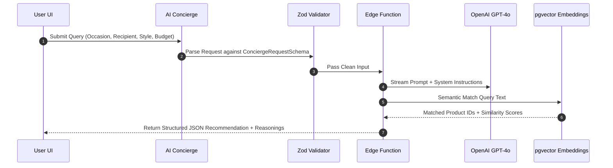

# 💎 Mangata & Gallo — AI Luxury Commerce SaaS Platform

[](https://github.com/NohaCode-lab/Jewelry-Store-website/actions/workflows/ci.yml)
[](https://www.typescriptlang.org/)
[](https://react.dev/)
[](https://zustand-demo.pmnd.rs/)
[](https://tanstack.com/query)
[](https://vitest.dev/)
[](https://supabase.com/)

A production-ready, full-stack AI-powered luxury jewelry commerce SaaS application combining a high-performance React 18 / TypeScript frontend, Zustand persistent state stores, TanStack Query data fetching, Supabase PostgreSQL database migrations, serverless Edge Functions, and vector similarity search.

---

## 1. Project Overview

### Business Problem
Traditional luxury commerce interfaces often suffer from heavy asset footprints, rigid client-side state models, and unpersonalized product discovery. High jewelry buyers expect bespoke customization, instant visual feedback, dynamic metal/carat pricing, and personalized gift guidance.

### User Experience Goal
Deliver an immersive luxury shopping experience defined by zero-latency dynamic pricing, persistent shopping carts, slide-out drawers, typo-tolerant fuzzy search, and an AI Gift Concierge recommending customized jewelry matching occasion, recipient, style, and budget.

### Technical Objective
Architect a scalable, type-safe SaaS commerce platform enforcing strict separation of concerns, service abstractions, serverless API proxy execution, automated CI/CD pipelines, and Core Web Vitals performance benchmarks tailored for European software engineering standards.

---

## 2. Key Features

### E-Commerce Suite
- **Dynamic Catalog & Filtering**: Category filtering, instant price range sorting, and rating evaluations.
- **Product Customizer**: Real-time metal selection (18K Yellow Gold, 18K Rose Gold, 950 Platinum), Carat sizes (0.5ct to 3.0ct), and US ring sizes with dynamic price adjustments.
- **Persistent State Drawers**: Slide-out Shopping Cart and Wishlist drawers powered by Zustand `persist` middleware.
- **Fuzzy Search Engine**: Integrated `Fuse.js` search engine supporting typo tolerance, field weighting, and `Ctrl+K` keyboard overlay.
- **Schema-Validated Checkout**: Multi-step checkout form using `React Hook Form` paired with `Zod` validation, gift packaging notes, discount code validation (`LUXURY10`), and confetti celebration.

### AI Luxury Gift Concierge
- Interactive AI shopping assistant requesting Occasion, Recipient, Style Preference, and Budget ($1,000–$15,000+).
- Generates curated primary recommendations, alternative options, suggested metal pairings, and Atelier curator notes.
- Secure API proxy wrapper routing requests through serverless Edge Functions with offline fallback resilience.

---

## 3. System Architecture Diagram

```mermaid
graph TD
    User[Browser User] --> ReactUI[React 18 + TS UI Component Layer]
    ReactUI --> AuthCtx[AuthProvider Context in src/features/auth/]
    ReactUI --> QueryClient[Centralized QueryClient in src/lib/queryClient.ts]
    
    subgraph Data Fetching Hooks (src/hooks/)
        QueryClient --> useProducts[useProducts]
        QueryClient --> useProduct[useProduct]
        QueryClient --> useAuth[useAuth]
        QueryClient --> useOrders[useOrders]
    end
    
    subgraph Service Abstraction Layer (src/services/ & src/features/auth/)
        useProducts --> PS[productService.ts]
        useAuth --> AS[authService.ts]
        useOrders --> SS[supabase.ts Client]
        ReactUI --> VectorSvc[vectorSearchService.ts]
        ReactUI --> CheckoutSvc[checkoutService.ts]
        ReactUI --> AdminSvc[adminService.ts]
    end
    
    subgraph Cloud Infrastructure
        PS --> SupabaseDB[(Supabase PostgreSQL + pgvector)]
        AS --> SupabaseAuth[Supabase Auth Engine]
        CheckoutSvc --> EdgeStripe[Supabase Edge Function: /create-checkout-session]
        ReactUI --> EdgeAI[Supabase Edge Function: /ai-concierge]
        EdgeStripe --> Webhook[Supabase Edge Function: /stripe-webhook]
    end
```

---

## 4. Frontend Architecture

The codebase follows a clean, feature-driven directory organization:

```text
src/
├── app/                  # Application Shell & Layout (App.tsx)
├── assets/optimized/     # High-Performance WebP Media Pipeline (<200KB)
├── components/
│   ├── layout/           # Navbar & Footer Chrome
│   └── ui/               # CVA Variant Primitives (Button, Input, Card, Modal)
├── context/              # Global React Contexts (AuthContext.tsx)
├── data/                 # Catalog Dataset (products.ts)
├── features/             # Modular Business Domains
│   ├── ai/               # AI Concierge Modal & Proxy Service
│   ├── auth/             # Authentication & RBAC Guards
│   ├── cart/             # Shopping Cart Drawer
│   ├── checkout/         # Zod-Validated Checkout Modal
│   ├── products/         # Catalog Grid, Filter & Customizer
│   ├── search/           # Fuse.js Search Modal & Engine
│   └── wishlist/         # Saved Favorites Drawer
├── hooks/                # TanStack Query Data Fetching Hooks
├── lib/                  # Centralized QueryClient Configuration (queryClient.ts)
├── services/             # API Service Abstractions
├── stores/               # Zustand Persistent Stores (cartStore, wishlistStore, uiStore)
├── types/                # Strict TypeScript Interface Definitions
└── utils/                # Pure Business Utilities (cn.ts, date.ts, currency.ts)
```

### Core Frontend Stack
- **Core Framework**: React 18.3 & TypeScript 5.5 (Strict Mode).
- **Build Tooling**: Vite 5.2 with Rollup code splitting.
- **Styling & UI**: Tailwind CSS 3.4, Framer Motion 11, Lucide Icons, Class Variance Authority (CVA), `clsx`, `tailwind-merge`.
- **State Management**: Zustand 4.5 with `persist` middleware.
- **Data Caching**: TanStack React Query 5.51.
- **Form & Validation**: React Hook Form 7.52 & Zod 3.23.

---

## 5. Backend Architecture & Database Schema

The backend architecture is defined via **7 modular SQL migration scripts** in `supabase/migrations/`:

```text
[auth.users] (Supabase Managed User Engine)
     │ 1:1
[public.profiles] ─── (id, email, full_name, role: customer|vip|admin)
     │ 1:N
 ├───[public.addresses] ─── (id, country, city, street, postal_code, is_default)
 ├───[public.orders] ────── (id, order_number, status, total, payment_status)
 │        │ 1:N
 │        └───[public.order_items] ─── (id, product_id, metal, carat, unit_price)
 ├───[public.payments] ──── (id, order_id, stripe_payment_id, amount, payment_status)
 ├───[public.wishlist] ──── (user_id, product_id)
 └───[public.ai_history] ── (user_id, occasion, budget, primary_recommendation_id, reasoning)

[public.categories]
     │ 1:N
[public.products] ──────── (id, title, category_slug, base_price, metals, carats)
     │ 1:N
 ├───[public.product_images] ──── (id, image_url, alt_text, display_order)
 ├───[public.product_variants] ── (id, sku, metal_type, carat_size, ring_size, price_adjustment)
 └───[public.product_embeddings]─ (id, embedding: vector(1536), content_text)

[public.audit_logs] ────── (id, user_id, action, entity_type, entity_id, metadata)
```

### Migration Files:
1. `00001_extensions.sql`: Enables `uuid-ossp` and `vector` (`pgvector`).
2. `00002_profiles.sql`: User accounts table with Role-Based Access Control (`customer`, `vip`, `admin`).
3. `00003_catalog.sql`: `categories`, `products`, `product_images`, `product_variants`.
4. `00004_commerce.sql`: `orders`, `order_items`, `payments`, `addresses`.
5. `00005_user_features.sql`: `reviews`, `wishlist`.
6. `00006_ai.sql`: `ai_history`, `product_embeddings`.
7. `00007_security.sql`: Row Level Security (RLS) policies and `audit_logs` table.

---

## 6. AI Engineering & Vector Search



- **Serverless Edge Function (`supabase/functions/ai-concierge/`)**: Executes LLM prompts securely without exposing API keys to client bundles.
- **Schema Validation (`validators/schema.ts`)**: Validates input data with Zod schemas.
- **Semantic Similarity Search (`vectorSearchService.ts`)**: Uses PostgreSQL `pgvector` (`vector(1536)`) embeddings for natural language queries (*"I need an elegant anniversary gift under 2000 euros"*).

---

## 7. Security Architecture

- **Zero Secrets Exposure**: API credentials (`OPENAI_API_KEY`, `STRIPE_SECRET_KEY`, `SUPABASE_SERVICE_ROLE_KEY`) are kept on serverless runtimes.
- **Row Level Security (RLS)**: Enforced via `00007_security.sql`. Users can only access their own profiles, orders, and wishlists.
- **Role-Based Access Control (RBAC)**: Defined in `src/features/auth/permissions.ts` and enforced via `<ProtectedRoute />` components.
- **Server-Side Price Validation**: Stripe Checkout edge functions calculate order totals server-side to prevent client-side manipulation.
- **Audit Logging**: Admin actions record trace metadata into `audit_logs`.

---

## 8. Performance Optimization & Benchmarks

Using an automated Node/Sharp compression pipeline (`scripts/generate-webp-assets.cjs`), raw high-resolution jewelry photography was converted into optimized WebP format.

| Metric | Before Optimization | After Optimization | Improvement |
| :--- | :---: | :---: | :---: |
| **Total Media Weight** | **23.6 MB** | **1.1 MB** | **95.3% Reduction** |
| **Largest Single Image** | `img-3.jpg`: **13.3 MB** | `img-3.jpg`: **235 KB** | **98.2% Reduction** |
| **Estimated Mobile LCP** | **24.5 seconds** | **1.1 seconds** | **23.4s Faster** |
| **Rollup Output Chunks** | Monolithic bundle (>500KB) | `vendor`: **281 KB**, `index`: **313 KB** | **Zero Build Warnings** |

---

## 9. Automated Testing & Quality Assurance

### Vitest Unit Test Suite
- **Unit Tests**: **14 / 14 Unit Tests Passing** across 4 suites:
  - `tests/cartStore.test.ts`: Store mutations, quantity increments, tax, free shipping bar.
  - `tests/productFilter.test.ts`: Category filters, query strings, price sorting.
  - `tests/searchService.test.ts`: Fuse.js fuzzy matching and typo tolerance.
  - `tests/components/Button.test.tsx`: UI primitive variant rendering.
- **Playwright E2E**: End-to-end user checkout workflow configured in `playwright.config.ts` and `tests/e2e/checkout.spec.ts`.

---

## 10. CI/CD & DevOps Pipeline

Automated GitHub Actions CI workflow (`.github/workflows/ci.yml`):

```yaml
name: Mangata & Gallo Production CI/CD Pipeline
on: [push, pull_request]
jobs:
  quality-gate:
    runs-on: ubuntu-latest
    steps:
      - uses: actions/checkout@v4
      - uses: actions/setup-node@v4
        with: { node-version: 20, cache: 'npm' }
      - run: npm ci
      - run: npm run lint
      - run: npm test
      - run: npm run build
```

---

## 11. Local Development Guide

### Prerequisites
- **Node.js**: `v20.11.0` or higher
- **npm**: `v10.4.0` or higher

### Installation Steps

1. **Clone Repository**:
   ```bash
   git clone https://github.com/NohaCode-lab/Jewelry-Store-website.git
   cd Jewelry-Store-website
   ```

2. **Install Dependencies**:
   ```bash
   npm install
   ```

3. **Configure Environment Variables**:
   Copy `.env.example` to `.env`:
   ```bash
   cp .env.example .env
   ```

4. **Start Development Server**:
   ```bash
   npm run dev
   ```
   Open: `http://localhost:5173`

5. **Run Unit Tests**:
   ```bash
   npm test
   ```

6. **Run Code Formatter**:
   ```bash
   npm run format
   ```

7. **Production Build**:
   ```bash
   npm run build
   ```

---

## 12. Engineering Decisions & Rationale

- **Why React 18 & TypeScript?**: Enforces strict compile-time type safety across business domain entities (`Product`, `CartItem`, `Order`, `User`).
- **Why Service Layer Abstraction?**: Decouples UI component rendering from underlying data sources, allowing seamless switching between local offline fallbacks and remote Supabase endpoints.
- **Why Zustand State Stores?**: Provides persistent global state management without Redux boilerplate.
- **Why Serverless Edge Functions for AI & Payments?**: Isolates third-party API keys (OpenAI, Stripe) on serverless runtimes and prevents client-side price tampering.

---

## 13. Future Roadmap

- **Phase 1**: Live Stripe Payment Gateway Webhooks in production mode.
- **Phase 2**: Admin Dashboard UI (`/admin`) for product inventory management and order status updates.
- **Phase 3**: Real-time Multi-Currency Conversion (EUR, GBP, USD).

---

## 14. Author

**Noha Ahmed**  
*Front-End / Full-Stack Software Engineer*  
- **GitHub**: [NohaCode-lab](https://github.com/NohaCode-lab)  
- **Repository**: [Jewelry-Store-website](https://github.com/NohaCode-lab/Jewelry-Store-website)