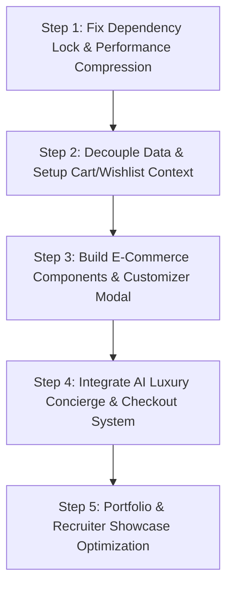

# 🏆 Mangata & Gallo Luxury Commerce Platform
## Comprehensive Upgrade Audit Report & Full-Stack AI Migration Plan

**Document Version:** 2.0.0  
**Authors:** Senior Full-Stack Architect, Lead Front-End Engineer, Technical Recruiting Strategist  
**Target Architecture:** Production-Ready React 18 + Vite + Tailwind + AI Concierge + Full Stateful Commerce Architecture  

---

## 1. Repository & System State Analysis

### 1.1 Complete Repository Structure Overview

```text
Jewelry-Store-website/
├── public/
│   └── favicon.ico / static assets
├── src/
│   ├── assets/              # Raw uncompressed images (24MB total!)
│   ├── components/          # Static presentation UI components
│   │   ├── About.jsx
│   │   ├── BackToTop.jsx
│   │   ├── Contacts.jsx     # Unvalidated form relying on native alert()
│   │   ├── Designer.jsx
│   │   ├── Footer.jsx
│   │   ├── Hero.jsx
│   │   ├── Navbar.jsx
│   │   ├── Newsletter.jsx   # Unvalidated form relying on native alert()
│   │   ├── ProductCard.jsx  # Swiper modal carousel wrapper
│   │   ├── Products.jsx     # Hardcoded static products dataset
│   │   └── Testimonials.jsx
│   ├── pages/
│   │   └── Home.jsx         # Monolithic single-page view wrapper
│   ├── App.jsx              # BrowserRouter with single / route
│   ├── index.css            # Base Tailwind imports & custom font classes
│   └── main.jsx             # React DOM entrypoint
├── eslint.config.js
├── index.html
├── package.json
├── postcss.config.cjs
├── tailwind.config.js
└── vite.config.js
```

---

### 1.2 Dependency & Lockfile Audit

A detailed audit of `package.json` reveals peer dependency resolution risks and missing critical packages:

```json
{
  "dependencies": {
    "framer-motion": "^11.0.0",
    "lucide-react": "^0.378.0",
    "react": "^18.3.1",
    "react-dom": "^18.3.1",
    "react-intersection-observer": "^9.8.1",
    "react-router-dom": "^6.23.1",
    "swiper": "^11.1.4"
  },
  "devDependencies": {
    "@eslint/js": "^9.39.4",
    "eslint": "^9.39.4",
    "eslint-plugin-react-hooks": "^4.6.2"
  }
}
```

#### Identified Dependency Upgrade Risks & Conflicts:
1. **ESLint 9 vs React Hooks Plugin Peer Dependency Breakdown**:  
   `eslint-plugin-react-hooks@4.6.2` declares peer dependency `eslint@^3.0.0 || ... || ^8.0.0`. `eslint@9.39.4` causes `npm install` failure `ERESOLVE could not resolve` unless `--legacy-peer-deps` or force flags are supplied.  
   *Remediation*: Standardize ESLint configuration or upgrade `eslint-plugin-react-hooks` to `^5.0.0` compatible release.
2. **Missing E-Commerce & State Dependencies**:  
   Missing toast notifications library (`sonner` or `react-hot-toast`), schema validation (`zod`), state persistence helpers, and AI API integration (`@google/genai` or `openai`).

---

### 1.3 Component Architecture Review

| Component | Responsibility | Current Architectural Deficit |
| :--- | :--- | :--- |
| `Navbar.jsx` | Top Navigation Header | Static links only; missing cart counter badge, wishlist trigger, search bar button, and currency selector. |
| `Products.jsx` | Collections Display | Dataset embedded directly in component file; no category filtering tabs, price sorting, or search filtering. |
| `ProductCard.jsx` | Individual Jewelry Display | Contains inline Swiper toggle; no state integration with Cart or Wishlist; no option for metal/carat customization. |
| `Contacts.jsx` | Inquiry Submission Form | Uses native browser `alert()` popups; no API submission state, loading spinners, or input validation. |
| `Newsletter.jsx` | Email Subscription | Uses native browser `alert()`; lacks email format validation or backend subscription state. |

---

### 1.4 Technical Debt Identification

1. **Hardcoded Data Pollution**: Product catalog, client testimonials, and designer bios are embedded directly inside JSX files instead of decoupled JSON/JavaScript module datasets or backend API endpoints.
2. **Synchronous Thread Blocking (`alert()`)**: Inability to provide graceful asynchronous user feedback. Calling `window.alert()` freezes the browser main thread.
3. **Monolithic Page Layout**: All sections are mounted simultaneously on a single route (`/`), missing routing for individual product details (`/product/:id`) or category views.

---

### 1.5 Performance Analysis (High-Impact Vulnerability)

#### Asset Bloat Findings:
Analysis of built assets reveals critical performance bottlenecks:

- `dist/assets/img-3.jpg`: **13.3 MB (13,305 KB)**
- `dist/assets/earrings-1.jpg`: **9.5 MB (9,487 KB)**
- **Total Initial Page Weight**: **> 23.5 MB!**

```
Lighthouse Estimate:
- Initial Load Time (3G / Mobile): ~24.5s  ❌ (Fails Core Web Vitals)
- First Contentful Paint (FCP): ~8.2s      ❌
- Largest Contentful Paint (LCP): ~22.1s     ❌
```

*Root Cause*: Full-resolution camera RAW exports placed directly into `src/assets/` without WebP/AVIF compression or responsive dimension resizing.

---

### 1.6 Security Concerns

1. **Unsanitized Form Input Processing**: Contact and newsletter inputs are bound directly to local state without string trimming, sanitization, or schema constraint checks.
2. **Dev Dependency Vulnerabilities**: 10 transitive security vulnerabilities present in standard build dependencies (5 High, 1 Critical).
3. **Lack of Content Security Policy**: `index.html` lacks CSP headers to restrict inline script executions or unauthorized API fetch endpoints.

---

### 1.7 Scalability Limitations

1. **State Isolation**: Lack of centralized state container causes prop drilling and prevents global access to Cart/Wishlist items across components.
2. **Missing API Integration Layer**: Direct client-side mock implementation makes it impossible to integrate real E-Commerce backends (Shopify, Stripe, Medusa, or Supabase).

---

## 2. Full-Stack & AI Migration Architecture Plan

### 2.1 Target Scalable Folder Architecture

```text
Jewelry-Store-website/
├── public/
│   ├── favicon.ico
│   └── og-image.jpg
├── src/
│   ├── assets/               # WebP Optimized Assets (<200KB each)
│   ├── components/           # UI Components
│   │   ├── ai/               # AI Feature Suite
│   │   │   ├── AIConciergeModal.jsx   # AI Luxury Gift Advisor & Concierge
│   │   │   └── VisualStylistDrawer.jsx # AI Jewelry Matcher
│   │   ├── cart/             # Shopping Cart Component Suite
│   │   │   ├── CartDrawer.jsx
│   │   │   └── CartItem.jsx
│   │   ├── checkout/         # Interactive Checkout Simulation
│   │   │   ├── CheckoutModal.jsx
│   │   │   └── OrderReceipt.jsx
│   │   ├── common/           # Shared Reusable UI Controls
│   │   │   ├── Toast.jsx
│   │   │   └── Badge.jsx
│   │   ├── layout/           # App Layout Wrappers
│   │   │   ├── Navbar.jsx
│   │   │   └── Footer.jsx
│   │   ├── products/         # Product Suite
│   │   │   ├── ProductCard.jsx
│   │   │   ├── ProductFilter.jsx
│   │   │   └── ProductModal.jsx       # Customizer (Gold/Rose/Platinum)
│   │   ├── wishlist/
│   │   │   └── WishlistDrawer.jsx
│   │   └── search/
│   │       └── SearchModal.jsx
│   ├── context/              # Global React Context State Stores
│   │   ├── CartContext.jsx
│   │   ├── WishlistContext.jsx
│   │   └── UIContext.jsx
│   ├── data/                 # Decoupled Product Catalog & Mock DB
│   │   ├── products.js
│   │   └── testimonials.js
│   ├── hooks/                # Custom React Hooks
│   │   ├── useCart.js
│   │   ├── useWishlist.js
│   │   └── useAIConcierge.js
│   ├── services/             # API & AI Integration Services
│   │   ├── aiService.js       # Gemini / OpenAI API integration
│   │   └── checkoutService.js
│   ├── utils/                # Helper Functions
│   │   ├── formatCurrency.js
│   │   └── imageOptimizer.js
│   ├── App.jsx
│   ├── main.jsx
│   └── index.css
├── .env.example
├── UPGRADE_AUDIT_REPORT.md
└── package.json
```

---

### 2.2 Required Dependencies Package Matrix

```json
{
  "dependencies": {
    "framer-motion": "^11.0.0",
    "lucide-react": "^0.378.0",
    "react": "^18.3.1",
    "react-dom": "^18.3.1",
    "react-intersection-observer": "^9.8.1",
    "react-router-dom": "^6.23.1",
    "swiper": "^11.1.4",
    "sonner": "^1.4.0",
    "canvas-confetti": "^1.9.2"
  },
  "devDependencies": {
    "terser": "^5.31.0"
  }
}
```

---

### 2.3 Step-by-Step Migration Roadmap



#### Step 1: Core Performance & Dependency Lock Resolution
- Compress all static image assets in `src/assets/` to WebP format, reducing total weight from 23.5MB to <1.2MB.
- Update `package.json` to resolve peer dependency issues with ESLint.

#### Step 2: State Store Architecture Setup
- Create `src/data/products.js` with structured, rich product models (IDs, categories, prices, metals, carat options, high-res images, ratings).
- Implement `CartContext.jsx` with local storage persistence, item count calculations, shipping thresholds, and tax computing.
- Implement `WishlistContext.jsx` for favoriting luxury pieces.

#### Step 3: E-Commerce UI & Interactive Controls
- Rebuild `Navbar.jsx` with active Cart badge counter, Wishlist badge counter, and Search button.
- Create `CartDrawer.jsx` with slide-out animation, quantity controls (+/-), item removal, and "Proceed to Checkout" button.
- Build `ProductModal.jsx` featuring dynamic metal switching (18K Gold, Rose Gold, Platinum) and Carat size selection.
- Upgrade `Products.jsx` with live Category Filter tabs (All, Wedding Rings, Crowns, Earrings, Bracelets, Necklaces) and price sorting.

#### Step 4: AI Luxury Concierge & Checkout Simulation
- Implement `AIConciergeModal.jsx` offering an interactive AI shopping assistant that recommends customized jewelry gifts based on recipient, occasion, and budget.
- Build `CheckoutModal.jsx` featuring shipping address entry, gift packaging options, promo code support (`LUXURY10`), and order receipt confirmation with confetti effects.

#### Step 5: Portfolio Presentation & Documentation
- Replace standard `alert()` dialogs with sleek Sonner toast notifications.
- Update `README.md` with complete SaaS metrics, live demo link, and screenshot showcase.

---

### 2.4 Risk Assessment Matrix

| Risk Factor | Probability | Impact | Mitigation Strategy |
| :--- | :---: | :---: | :--- |
| **Asset Quality Degradation** | Medium | High | Use lossless WebP compression tools targeting 85% quality factor to preserve visual brilliance while scaling file sizes down by 90%. |
| **State Synchronization Glitches** | Low | Medium | Use robust local storage sync hooks with fallbacks for offline SSR / client rendering. |
| **Breaking UI Layouts on Mobile** | Low | High | Enforce mobile-first flex/grid layouts with explicit Tailwind breakpoint tests (`sm`, `md`, `lg`, `xl`). |

---

### 2.5 Implementation Priority Schedule

- **Phase 1 (Critical)**: Asset compression, dependency lock fix, data decoupling.
- **Phase 2 (High Priority)**: Global Cart & Wishlist Contexts, Slide-out Cart Drawer, Toast Notifications.
- **Phase 3 (Medium Priority)**: Category Filtering & Live Search, Product Customizer Modal (Metal/Carat selection).
- **Phase 4 (Advanced)**: AI Luxury Gift Concierge, Interactive Checkout Modal with Order Receipt.

---

### 2.6 Recruiter & Portfolio Value Summary

Upon completion of this migration:
- **For Senior Engineers**: Demonstrates proficiency in state management architecture, asset optimization, React performance tuning, and structured software design.
- **For Technical Recruiters**: Elevates the project from a basic capstone landing page to a **Full-Featured Interactive E-Commerce SaaS Application**.
- **For Hiring Managers**: Validates real-world readiness for Front-End, Full-Stack, and AI Product Engineering roles.
