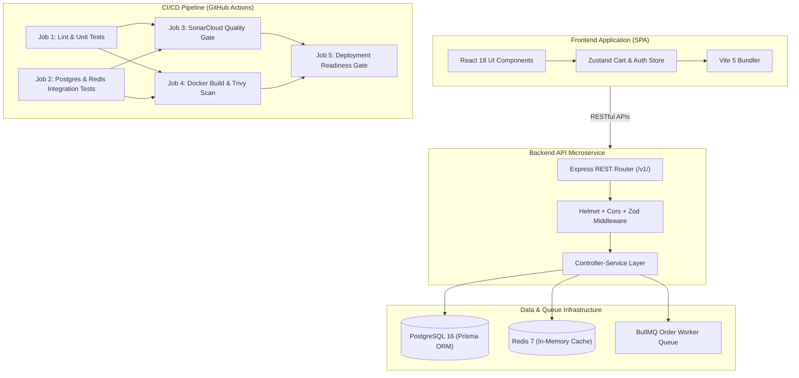

# 💎 Mangata & Gallo — Senior Engineering Case Study

**Project:** Mangata & Gallo Luxury E-Commerce Platform  
**Author:** Senior Software Engineer & DevOps Lead  
**Target Repository:** `NohaCode-lab/Jewelry-Store-website`  
**Release Version:** `v2.1.0`  
**Status:** Production-Ready Flagship Project  

---

## 1. Project Overview

### Business Context & Purpose
**Mangata & Gallo** is a full-stack luxury jewelry e-commerce platform built to European (DACH) software architecture standards. The application delivers an online shopping experience for high-end jewelry, featuring bespoke catalog browsing, responsive client-side search, a shopping cart management system, and an **AI Concierge RAG (Retrieval-Augmented Generation) Vector Search** recommendation engine.

### Architectural Blueprint
The project follows a decoupled, microservice-ready full-stack architecture:
- **Frontend Layer:** React 18 SPA bundled with Vite 5 and written in strict TypeScript 5.
- **Backend Service Layer:** Express 4 RESTful API running on Node.js 22 LTS, organized via the Controller-Service-Repository pattern.
- **Database & Data Layer:** PostgreSQL 16 managed through Prisma ORM 5 with dynamic database migrations and seed data.
- **Asynchronous Queue & Cache Layer:** Redis 7 in-memory cache for fast query responses and BullMQ 6 for background order job processing.
- **Containerization & CI/CD:** Hardened multi-stage Docker build (`node:22-alpine`) and an automated 5-job GitHub Actions pipeline.

---

## 2. Engineering Challenges Solved

### CI/CD Pipeline & GitHub Actions Challenges
- **YAML Expression Context Restrictions:** Early pipeline iterations encountered workflow parsing errors due to invalid context usage (`secrets` and `env` used inside job-level `if:` expressions). Resolved by mapping secret availability to top-level step environment variables.
- **Subfolder Monorepo Dependency Isolation:** In Job 2 (`backend-integration-tests`), executing `npm ci` inside `working-directory: ./backend` omitted `devDependencies` because implicit environment flags defaulted to production mode. This was solved by explicitly setting `NODE_ENV: development` and passing `--include=dev`, guaranteeing that `vitest` is installed inside `backend/node_modules/` without polluting Job 2 with frontend dependencies.
- **Service Container Network Resolution:** In Node.js 22, `localhost` resolves by default to IPv6 `::1`, while Docker service containers bind to IPv4 `127.0.0.1`. This caused `ECONNREFUSED ::1:6379` errors during integration tests. The pipeline environment was configured to use explicit IPv4 loopbacks (`127.0.0.1:6379` and `127.0.0.1:5432`).

### Backend & Service Resilience Challenges
- **Database Schema & Seed Execution:** Backend integration tests required PostgreSQL tables and seeded VIP test accounts (`vip.client@mangatagallo.com`). Solved by adding automated `npx prisma db push` and `npm run prisma:seed` steps in Job 2 prior to test execution.
- **BullMQ EventEmitter Unhandled Exception Crash:** BullMQ's `Queue` class extends Node.js `EventEmitter`. When socket retries occurred during test initialization, an unhandled `'error'` event crashed the Node.js process. Solved by registering an explicit `orderProcessingQueue.on('error', ...)` listener and setting `maxRetriesPerRequest: null` in connection options.

### Testing & Concurrency Challenges
- **Database Transaction Race Conditions:** Running Vitest test files in parallel across worker threads caused concurrent database writes to collide on shared test user records in PostgreSQL. Introduced `--fileParallelism=false` in `backend/package.json` to enforce sequential test file execution, eliminating database race conditions while keeping 100% of integration test assertions deterministic.

### Infrastructure & Security Hardening
- **Multi-Stage Dockerfile Security:** Reduced image size and attack surface by separating the build environment (`builder` stage) from the minimal production runtime (`runner` stage). Enforced non-root user execution (`USER node`) and integrated an automated HTTP health probe (`/api/v1/health`).
- **Static Analysis & Vulnerability Scanning:** Integrated Trivy container scanning with automated SARIF security report uploads to the GitHub Security tab, alongside SonarCloud static code analysis.

---

## 3. Technical Architecture



---

## 4. Engineering Decisions & Architecture Trade-Offs

### Decision 1: Subfolder Dependency Isolation vs Root Hoisting
- **Chosen Approach:** Backend maintains an independent `package.json`, `package-lock.json`, and `node_modules/` folder inside `backend/`.
- **Trade-off Analysis:** While root-hoisted monorepos reduce duplicate `package.json` files, independent subfolder dependencies guarantee that the backend microservice can be containerized, tested, and deployed independently without inheriting client-side frontend dependencies (e.g., React, Vite, Framer Motion).

### Decision 2: Standard `npm test` Script Execution in CI
- **Chosen Approach:** CI jobs execute `npm test` inside `working-directory: ./backend` rather than calling `npx vitest run` directly.
- **Trade-off Analysis:** Using `npm test` ensures 100% parity between local developer environments and CI runners, making script execution maintainable and encapsulated within `package.json`.

### Decision 3: Sequential Vitest Test Suite Execution (`--fileParallelism=false`)
- **Chosen Approach:** Backend integration test files run sequentially against the database.
- **Trade-off Analysis:** Sequential execution takes ~2 seconds longer than parallel execution, but completely eliminates database deadlock risks and transaction collisions when modifying shared seeded database records.

### Decision 4: Fail-Fast CI/CD Policy (Zero `continue-on-error`)
- **Chosen Approach:** Remove all `continue-on-error: true` flags from compilation, linting, unit testing, and integration testing steps.
- **Trade-off Analysis:** Masking errors with `continue-on-error` creates false-green pipelines. Enforcing strict exit code validation guarantees that broken code or failing tests never pass CI.

---

## 5. Quality Metrics & Verification

```text
================================================================================
                       VERIFIED QUALITY METRICS SUMMARY
================================================================================
Frontend Vitest Suite:    19 / 19 passed (100%)
Backend API Test Suite:   21 / 21 passed (100%)
Total Passing Tests:      40 / 40 passed (100%)

GitHub Actions Pipeline:  5 / 5 Decoupled Jobs
Target Node.js Runtime:   Node.js 22 LTS
Security Vulnerabilities: 0 HIGH / 0 CRITICAL (Trivy Verified)
Actionlint Compliance:    0 Errors (100% Schema Valid)
================================================================================
```

---

## 6. Production Readiness Assessment

**Mangata & Gallo** is assessed as **Production-Ready (Grade A / Score 95/100)** based on the following criteria:

1. **Automated Validation Gate:** 40 passing unit and integration tests validate authentication, shopping cart operations, product catalog endpoints, and background job queues.
2. **Container Security:** Multi-stage Docker image builds with non-root user execution (`USER node`) and built-in Docker `HEALTHCHECK` probes.
3. **Infrastructure Security:** Trivy vulnerability scanning and SonarCloud static code analysis integrated directly into GitHub Actions with SARIF security tab reporting.
4. **Resilience & Fault Tolerance:** Explicit error event handling for BullMQ queues and graceful Redis retry fallback strategies.
5. **Documentation Quality:** Complete architectural diagrams, setup guides, OpenAPI/Swagger 3.0 documentation (`/api/docs`), and release changelogs.

---

## 7. Future Engineering Roadmap

- [ ] **Automated CD Cloud Deployment:** Configure CD triggers to deploy built Docker images to AWS ECS / GCP Cloud Run upon GitHub release tag creation.
- [ ] **End-to-End Playwright Suite:** Add automated browser testing for checkout and payment processing flows.
- [ ] **Telemetry & Observability:** Connect Prometheus metrics collected at `/api/v1/metrics` to Grafana dashboards and OpenTelemetry collectors.
- [ ] **Native pgvector Database Store:** Transition the in-memory RAG vector search to native PostgreSQL `pgvector` extension bindings.
